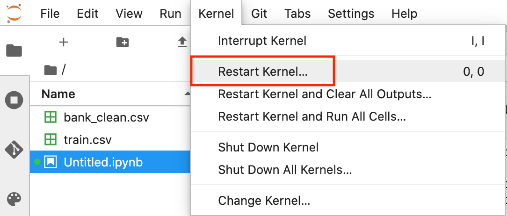

SageMaker: Starting XGBoost with SageMaker V2.24
=======================================
 
이 자습서에서는 Amazon SageMaker를 사용하여 기계 학습(ML) 모델을 구축, 훈련 및 배포하는 방법을 알려드립니다. 이 실습에서는 일반적으로 사용하는 XGBoost ML 알고리즘을 사용합니다. Amazon SageMaker는 개발자와 데이터 과학자가 대규모로 기계 학습 모델을 구축, 훈련 및 배포할 수 있는 완전 관리형 모듈식 기계 학습 서비스입니다.

일반적으로 기계 학습 모델을 개념화에서부터 프로덕션까지 진행시키는 작업은 복잡하고 시간이 오래 걸립니다. 모델을 훈련하기 위한 대량의 데이터를 관리하고, 훈련에 가장 적합한 알고리즘을 선택하고, 훈련하는 도중에 컴퓨팅 용량을 관리하고, 나중에는 모델을 프로덕션 환경에 배포해야 합니다. Amazon SageMaker는 기계 학습 모델을 훨씬 간편하게 구축 및 배포함으로써 이러한 복잡성을 낮춥니다. 다양한 옵션 중에서 적절한 알고리즘과 프레임워크를 선택하고 나면, Amazon SageMaker가 모델을 페타바이트 규모로 훈련하기 위한 모든 기본 인프라를 관리하고 프로덕션에 배포합니다.

이 자습서에서는 은행에서 일하는 기계 학습 개발자라고 가정합니다. 여러분은 고객이 예금 증서(CD)에 등록할지 예측하는 기계 학습 모델 개발 요청을 받았습니다. 모델은 고객 인구 통계 정보, 마케팅 행사에 대한 반응, 외부 요소에 대한 정보가 포함된 마케팅 데이터 세트로 훈련됩니다.

데이터 세트는 여러분의 편의에 따라 레이블이 표시되었고, 데이터 세트에 있는 열은 고객이 은행에서 제안하는 상품에 등록했는지 여부를 나타냅니다. 이 데이터 세트 버전은 어바인 소재의 University of California에서 큐레이션한 기계 학습 리포지토리에서 공개 제공됩니다. 이 자습서에서는 데이터에 레이블이 표시되어 있으므로 지도형 기계 학습 모델을 구현합니다. (데이터 세트에 레이블이 표시되지 않았을 때 비지도형 학습이 발생합니다.)
이 자습서 개요

1. 노트북 인스턴스 생성
2. 데이터 준비
3. 데이터에서 학습하도록 모델 훈련
4. 모델 배포
5. 기계 학습 모델의 성능 평가
 
이 자습서에서 생성되고 사용된 리소스는 AWS 프리 티어에 해당합니다. 7단계를 완료하고 리소스를 종료해야 합니다. 2개월 이상 계정에서 이 리소스가 활성화되어 있으면 계정에 0.50 USD 미만의 비용이 청구됩니다.


# 1단계. Amazon SageMaker 콘솔 열기
## Amazon SageMaker 콘솔로 이동합니다.
여기를 클릭하면 AWS Management Console이 새 창에서 열리므로 이 단계별 안내서를 계속 열어 놓을 수 있습니다. 검색창에 SageMaker를 입력하고 Amazon SageMaker를 선택해서 서비스 콘솔을 엽니다.


# 2단계. Amazon SageMaker 노트북 인스턴스 생성
## 이 단계에서는 Amazon SageMaker 노트북 인스턴스를 생성합니다. 

#### 2a. Amazon SageMaker 대시보드에서 노트북 인스턴스를 선택합니다. 


#### 2b. 노트북 인스턴스 생성 페이지에서 [노트북 인스턴스 이름] 필드에 이름을 입력합니다. 이 자습서에서는 인스턴스 이름으로 MySageMakerInstance를 사용하지만, 원하는 경우 다른 이름을 선택할 수 있습니다.

이 자습서에서는 기본 노트북 인스턴스 유형인 ml.t2.medium을 그대로 사용할 수 있습니다.

노트북 인스턴스가 데이터에 액세스하고 안전하게 Amazon S3에 데이터를 업로드하도록 허용하려면 IAM 역할을 지정해야 합니다. [IAM 역할] 필드에서 [새 역할 생성]을 선택하고 Amazon SageMaker가 필수 권한을 가진 역할을 생성하고 인스턴스에 할당하도록 합니다. 또는, 계정에서 이를 위한 목적으로 사용할 기존의 IAM 역할을 선택할 수 있습니다.


#### 2c. [IAM 역할 생성] 상자에서 아무 S3 버킷을 선택합니다. Amazon SageMaker 인스턴스가 계정에 있는 모든 S3 버킷에 액세스하게 됩니다. 이 자습서 후반에서 새 S3 버킷을 생성할 예정입니다. 그러나 사용하려는 버킷이 있을 경우, 특정 S3 버킷을 선택하고 버킷 이름을 지정하십시오.
[역할 생성]을 선택합니다.


#### 2d. Amazon SageMaker가 AmazonSageMaker-ExecutionRole-***이라는 역할을 생성한 것을 확인하십시오.

이 자습서에서는 다른 필드에 기본값을 사용합니다. [노트북 인스턴스 생성]을 선택합니다.


#### 2e. 노트북 인스턴스 페이지에서 새 MySageMakerInstance 노트북 인스턴스가 Pending 상태여야 합니다.

노트북 인스턴스는 2분 이내에 Pending에서 InService 상태로 변경됩니다.


# 3단계. 데이터 준비
## 이 단계에서는 Amazon SageMaker 노트북을 사용하여 기계 학습 모델을 훈련하는 데 필요한 데이터를 미리 처리합니다.
#### 3a. 노트북 인스턴스 페이지에서 MySageMakerInstance가 Pending에서InService 상태로 전환되기를 기다립니다.
상태가 InService로 전환되면 MySageMakerInstance를 선택하고 [작업] 드롭다운 메뉴를 사용하거나 InService 상태 옆에 있는 [Jupyter 열기]를 선택하여 엽니다.


#### 3b. Jupyter가 열리면 [파일] 탭에서 [새로 만들기]를 선택한 다음, conda_python3를 선택합니다. 


#### 3c. 데이터를 준비하고, 기계 학습 모델을 훈련하여 배포하려면 Jupyter 노트북 환경에 몇 가지 라이브러리를 가져와서 몇 가지 환경 변수를 정의해야 합니다. 다음의 코드를 인스턴스의 코드 셀에 복사하고 [실행]을 선택합니다.

최신 버전으로 인스톨합니다.
```python
pip install --upgrade sagemaker
```

노트북 커널을 리스트합니다.


코드가 실행되는 동안 오른쪽의 첫 번째 스크린샷에 나타난 것과 같이 꺾쇠괄호 사이에 *가 표시됩니다. 몇 초 후에 코드 실행이 완료되고 *가 1로 대체되며, 오른쪽 두 번째 스크린샷에 나타난 것과 같이 성공 메시지가 표시됩니다. 

```python

# import libraries
import boto3, re, sys, math, json, os, sagemaker, urllib.request
from sagemaker import get_execution_role
import numpy as np                                
import pandas as pd                               
import matplotlib.pyplot as plt                   
from IPython.display import Image                 
from IPython.display import display               
from time import gmtime, strftime                 
from sagemaker.predictor import csv_serializer   

# Define IAM role
role = get_execution_role()
prefix = 'sagemaker/DEMO-xgboost-dm'
containers = {'us-west-2': '433757028032.dkr.ecr.us-west-2.amazonaws.com/xgboost:latest',
              'us-east-1': '811284229777.dkr.ecr.us-east-1.amazonaws.com/xgboost:latest',
              'us-east-2': '825641698319.dkr.ecr.us-east-2.amazonaws.com/xgboost:latest',
              'eu-west-1': '685385470294.dkr.ecr.eu-west-1.amazonaws.com/xgboost:latest'} # each region has its XGBoost container
my_region = boto3.session.Session().region_name # set the region of the instance
print("Success - the MySageMakerInstance is in the " + my_region + " region. You will use the " + containers[my_region] + " container for your SageMaker endpoint.")
```


#### 3d. 이 단계에서는 이 자습서에서 데이터를 저장할 S3 버킷을 생성합니다.

다음의 코드를 노트북의 다음 코드 셀에 복사하고 S3 버킷의 이름을 고유하게 변경합니다. S3 버킷 이름은 전체적으로 중복이 없어야 하며 그 외에 다른 제한 사항이 있습니다.

[실행]을 선택합니다. 성공 메시지가 수신되지 않으면 **버킷이름을 변경(e.g. you-s3-bucket-name)** 하고 다시 시도하십시오.

```python
bucket_name = 'your-s3-bucket-name' # <--- CHANGE THIS VARIABLE TO A UNIQUE NAME FOR YOUR BUCKET
s3 = boto3.resource('s3')
try:
    if  my_region == 'us-east-1':
      s3.create_bucket(Bucket=bucket_name)
    else: 
      s3.create_bucket(Bucket=bucket_name, CreateBucketConfiguration={ 'LocationConstraint': my_region })
    print('S3 bucket created successfully')
except Exception as e:
    print('S3 error: ',e)
```


#### 3e. 다음으로는 데이터를 Amazon SageMaker 인스턴스에 다운로드하고 데이터 프레임에 로드해야 합니다. 다음 코드를 복사하고 [실행]합니다.
```python
try:
  urllib.request.urlretrieve ("https://d1.awsstatic.com/tmt/build-train-deploy-machine-learning-model-sagemaker/bank_clean.27f01fbbdf43271788427f3682996ae29ceca05d.csv", "bank_clean.csv")
  print('Success: downloaded bank_clean.csv.')
except Exception as e:
  print('Data load error: ',e)

try:
  model_data = pd.read_csv('./bank_clean.csv',index_col=0)
  print('Success: Data loaded into dataframe.')
except Exception as e:
    print('Data load error: ',e)
```


#### 3f. 이제 데이터를 셔플하고 훈련 데이터와 테스트 데이터로 나눕니다.

훈련 데이터(고객의 70%)는 모델 훈련 루프에서 사용됩니다. 기울기 기반 최적화를 사용하여 모델 파라미터를 반복적으로 개선합니다. 기울기 기반 최적화는 모델 손실 함수의 기울기를 사용하여 모델 오류를 최소화하는 모델 파라미터값을 찾는 방법입니다.

테스트 데이터(고객의 나머지 30%)는 모델의 성능을 평가하고 훈련된 모델이 처음 보는 데이터를 일반화하는 성능을 평가하는 데 사용됩니다.

다음 코드를 새 코드 셀에 복사하고 [실행]을 선택하여 데이터를 셔플 및 분할합니다.
```python
train_data, test_data = np.split(model_data.sample(frac=1, random_state=1729), [int(0.7 * len(model_data))])
print(train_data.shape, test_data.shape)
```


# 4단계. 데이터에서 모델 훈련
## 이 단계에서는 훈련 데이터 세트로 기계 학습 모델을 훈련합니다. 

#### 4a. Amazon SageMaker의 사전 구축된 XGBoost 모델을 사용하려면 훈련 데이터의 헤더와 첫 번째 열의 형식을 다시 지정하고 S3 버킷에서 데이터를 로드해야 합니다.

다음 코드를 새 코드 셀에 복사하고 [실행]을 선택하여 데이터의 형식을 새로 지정하고 데이터를 로드합니다.
```python
pd.concat([train_data['y_yes'], train_data.drop(['y_no', 'y_yes'], axis=1)], axis=1).to_csv('train.csv', index=False, header=False)
boto3.Session().resource('s3').Bucket(bucket_name).Object(os.path.join(prefix, 'train/train.csv')).upload_file('train.csv')
s3_input_train = sagemaker.inputs.TrainingInput(s3_data='s3://{}/{}/train'.format(bucket_name, prefix), content_type='csv')
```

#### 4b. 그다음에는 Amazon SageMaker 세션을 설정하고, XGBoost 모델(추정 도구)의 인스턴스를 생성하고, 모델의 하이퍼파라미터를 정의해야 합니다. 다음 코드를 새 코드 셀에 복사하고 [실행]을 선택합니다.
```python
sess = sagemaker.Session()
xgb = sagemaker.estimator.Estimator(containers[my_region],role, instance_count=1, instance_type='ml.m4.xlarge',output_path='s3://{}/{}/output'.format(bucket_name, prefix),sagemaker_session=sess)
xgb.set_hyperparameters(max_depth=5,eta=0.2,gamma=4,min_child_weight=6,subsample=0.8,silent=0,objective='binary:logistic',num_round=100)
```
#### 4c. 데이터를 로드하고 XGBoost 추정 도구를 설정하고 나면, 다음 코드를 새 코드 셀에 복사하고 [실행]을 선택해서 ml.m4.xlarge 인스턴스에서 기울기 최적화로 모델을 훈련합니다.

몇 분 후에 훈련 로그가 생성되는 것이 보입니다.
```python
xgb.fit({'train': s3_input_train})
```


# 5단계. 모델 배포
## 이 단계에서는 훈련된 모델을 엔드포인트로 배포하고, CSV 데이터의 형식을 다시 지정하여 로드한 다음에는, 모델을 실행하여 예측을 생성합니다.
#### 5a. 서버에 모델을 배포하고 액세스할 수 있는 엔드포인트를 생성하려면 다음 코드를 다음 코드 셀에 복사하고 [실행]을 선택합니다.
```python
xgb_predictor = xgb.deploy(initial_instance_count=1,instance_type='ml.m4.xlarge')
```


#### 5b. 테스트 데이터의 고객이 은행 상품에 가입했는지 예측하려면 다음 코드를 다음 코드 셀에 복사하고 [실행]을 선택합니다.
```python
test_data_array = test_data.drop(['y_no', 'y_yes'], axis=1).values #load the data into an array
xgb_predictor.content_type = 'text/csv' # set the data type for an inference
xgb_predictor.serializer = csv_serializer # set the serializer type
predictions = xgb_predictor.predict(test_data_array).decode('utf-8') # predict!
predictions_array = np.fromstring(predictions[1:], sep=',') # and turn the prediction into an array
print(predictions_array.shape)
```


# 6단계. 모델 성능 평가
## 이 단계에서는 기계 학습 모델의 성능과 정확도를 평가합니다.
#### 6a. 아래의 코드를 복사하여 붙여넣고 [실행]을 선택하여 오차 행렬이라는 테이블에서 실제 값과 예측값을 비교합니다.

예측에 기반하여 테스트 데이터에서 고객의 90%가 정확하게 예금 증서에 가입할 것으로 예측된다는 결론을 내릴 수 있습니다. 가입 고객에 대한 정밀도는 65%(278/429), 가입하지 않은 고객에 대한 정밀도는 90%(10,785/11,928)입니다.

```python
cm = pd.crosstab(index=test_data['y_yes'], columns=np.round(predictions_array), rownames=['Observed'], colnames=['Predicted'])
tn = cm.iloc[0,0]; fn = cm.iloc[1,0]; tp = cm.iloc[1,1]; fp = cm.iloc[0,1]; p = (tp+tn)/(tp+tn+fp+fn)*100
print("\n{0:<20}{1:<4.1f}%\n".format("Overall Classification Rate: ", p))
print("{0:<15}{1:<15}{2:>8}".format("Predicted", "No Purchase", "Purchase"))
print("Observed")
print("{0:<15}{1:<2.0f}% ({2:<}){3:>6.0f}% ({4:<})".format("No Purchase", tn/(tn+fn)*100,tn, fp/(tp+fp)*100, fp))
print("{0:<16}{1:<1.0f}% ({2:<}){3:>7.0f}% ({4:<}) \n".format("Purchase", fn/(tn+fn)*100,fn, tp/(tp+fp)*100, tp))
```


# 7단계. 리소스 종료
## 이 단계에서는 Amazon SageMaker 관련 리소스를 종료합니다.

중요: 현재 사용되지 않는 리소스를 종료하면 비용이 절감되므로 권장됩니다. 리소스를 종료하지 않으면 요금이 부과됩니다.
#### 7a. S3 버킷에서 Amazon SageMaker 엔드포인트와 객체를 삭제하려면 다음 코드를 복사해서 붙여넣고 [실행]합니다.  
```python
sagemaker.Session().delete_endpoint(xgb_predictor.endpoint)
bucket_to_delete = boto3.resource('s3').Bucket(bucket_name)
bucket_to_delete.objects.all().delete()
```


# 축하합니다!
Amazon SageMaker를 사용하여 기계 학습 모델을 준비, 훈련, 배포 및 평가하는 방법을 배우셨습니다. Amazon SageMaker는 훈련 데이터에 신속히 연결하는 데 필요한 모든 것을 제공하여 손쉽게 기계 학습 모델을 구축하고, 애플리케이션에 맞는 최적의 알고리즘과 프레임워크를 선택하면서도 모든 기본 인프라를 관리하여 페타바이트 규모로 모델을 훈련할 수 있도록 지원합니다.

